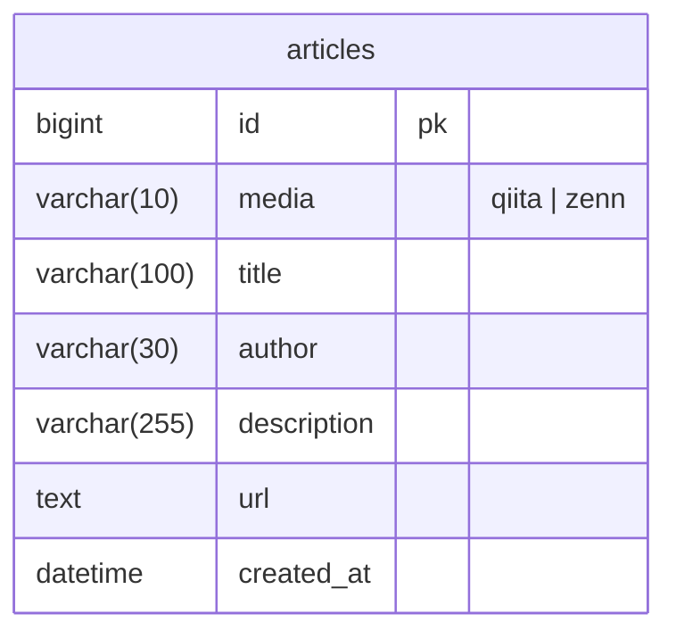

# 記事テーブルの設計

Status: Accepted

Relevant PR:
- https://github.com/Geek-Teck-Mentors/trend_diary/pull/107

# Context
新たに記事を格納するテーブルを作成するための設計を行なっていた
細かいデータ型やカラム名の命名などが議論になった

## References
- [issue](https://github.com/Geek-Teck-Mentors/trend_diary/issues/90)
- [Discordの関連スレッド](https://discord.com/channels/1126373101832257628/1361646771696304200)

# Decision

以下の設計にする

## Reason

- urlは数年に一度長さの上限値が増えているのでtext型にする
- updated_atはupdateを行うことがないので不要
- description, author, titleは感覚値で設定

# Consequences

- システムの使用が確定した
