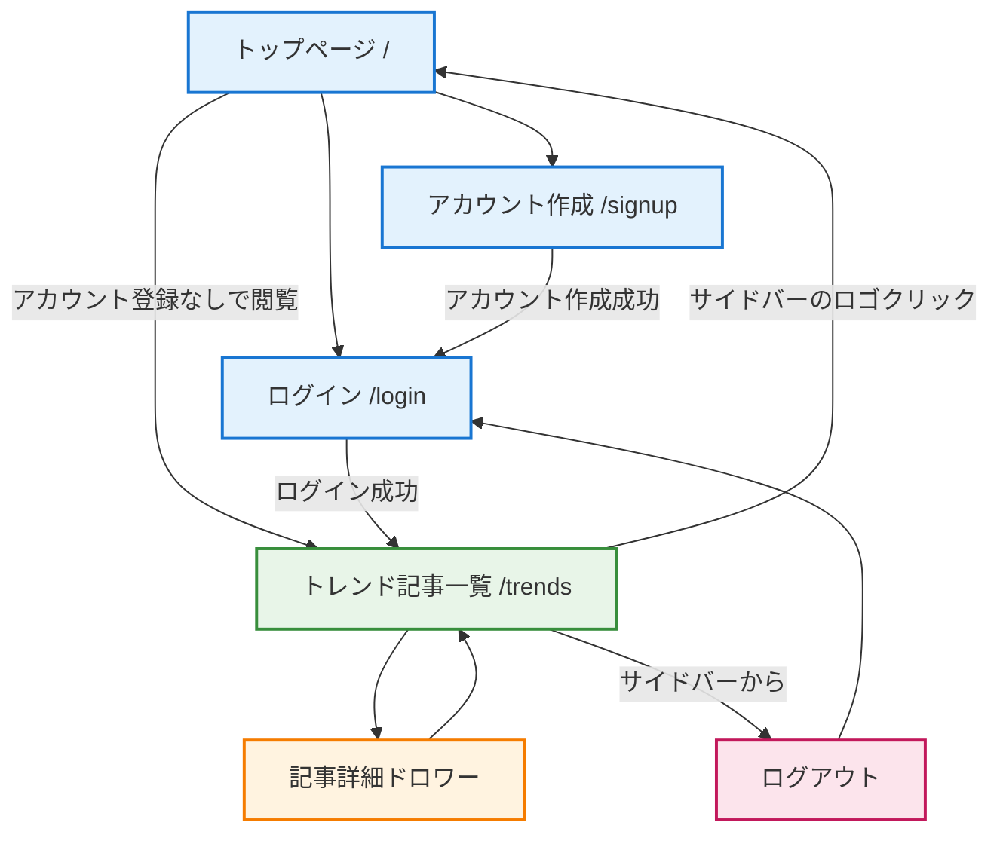

# TrendDiary 画面遷移図

## 概要

TrendDiaryの画面遷移とユーザーフローを図示します。アプリケーションは認証機能とトレンド記事管理機能を中心に構成されています。

## 画面遷移図

## 画面詳細

### 認証関連画面

#### トップページ (/)
- **目的**: アプリケーションの紹介とユーザー誘導
- **主要機能**:
  - サービス説明
  - 推奨環境の表示
  - アカウント作成/ログインへの導線
- **遷移先**:
  - アカウント作成ページ (`/signup`)
  - ログインページ (`/login`)
  - トレンド記事一覧 (`/trends`) - アカウント登録なしで閲覧

#### アカウント作成ページ (/signup)
- **目的**: 新規ユーザーの会員登録
- **主要機能**:
  - メールアドレス・パスワード入力
  - バリデーション
  - エラーハンドリング
- **遷移先**:
  - 成功時: ログインページ (`/login`)

#### ログインページ (/login)
- **目的**: 既存ユーザーの認証
- **主要機能**:
  - メールアドレス・パスワード認証
  - エラーハンドリング
- **遷移先**:
  - 成功時: トレンド記事一覧 (`/trends`)

### メイン機能画面

#### トレンド記事一覧 (/trends)
- **目的**: 技術記事の管理・閲覧
- **レイアウト**: サイドバー付きレイアウト
- **主要機能**:
  - 記事一覧表示（QiitaやZennの記事）
  - 既読/未読状態の管理
  - ページネーション
  - サイドバーでのナビゲーション
- **遷移先**:
  - 記事詳細ドロワー（同一画面内）
  - トップページ（サイドバーのロゴクリック）
  - ログアウト機能

#### 記事詳細ドロワー
- **目的**: 記事の詳細表示と既読/未読操作
- **表示形式**: サイドドロワー（オーバーレイ）
- **主要機能**:
  - 記事内容の表示
  - 既読/未読の切り替え
  - 外部リンクへの遷移
- **遷移先**:
  - ドロワー閉じて一覧に戻る

## ユーザーフロー

### 新規ユーザー
1. トップページでサービス概要を確認
2. 「無料で始める」からアカウント作成
3. 作成後、ログインページに自動遷移
4. ログイン後、メイン機能（記事一覧）にアクセス

### 既存ユーザー
1. トップページまたは直接ログインページにアクセス
2. 認証情報を入力してログイン
3. メイン機能（記事一覧）で記事管理を実行

### ゲストユーザー（認証なし）
1. トップページでサービス概要を確認
2. 「記事一覧を見る」から直接トレンド記事一覧にアクセス
3. 記事の閲覧のみ可能（既読/未読管理は利用不可）
4. サイドバーのロゴクリックでトップページに戻る

### セッション管理
- ログイン状態はクッキーベースで管理
- ログアウト時はセッション削除後、ログインページに遷移
- 未認証時の保護されたページアクセスは適切にハンドリング
