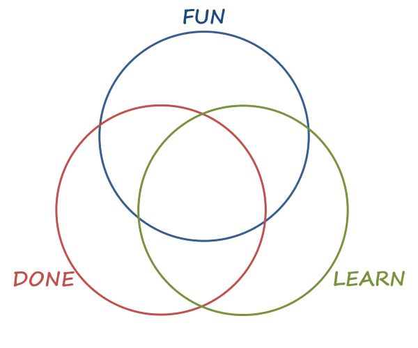

## スクラムルール

時間配分 MAX: 2h

レビュー : レトロ : プラン = 4 : 4 : 2

### スプリントレビュー

1. 先週のスプリントゴールの達成の確認
2. スプリントの成果(インクリメント)を共有

- フィードバック
- プロダクトの視点

### スプリントレトロスペクティブ

- 「Good/面白かったこと」, 「More」, 「NA」を共有
- Fun Done Learnをベースに適応

Fun Done Learnとは

Fun Done Learnとは、「Fun(楽しかったこと)」「Done(やったこと)」「Learn(学びを得たこと)」の３つの観点から考えるフレームワーク

1. 楽しかったこと(FUN)、やったこと(DONE)、学びを得たこと(LEARN)のいずれかに該当しそうなものを書き出す
2. 書き出したものが集合のどの部分に該当するかを説明する
3. そしてその理由とその詳細を説明する

進め方

1. FUN, DONE, LEARNのいずれかを書き出して、フレームワークに沿って説明する
2. それを元にフリートーク

- 「それに関連するこういう技術あるよ」
- 「次はこういうタスクのやり方のほうがもっと楽しめそう」など

### スプリントプランニング

1. PBIの確認(概要,受け入れ条件)
2. 見積もり(プランニングポーカー)
3. アサイン
