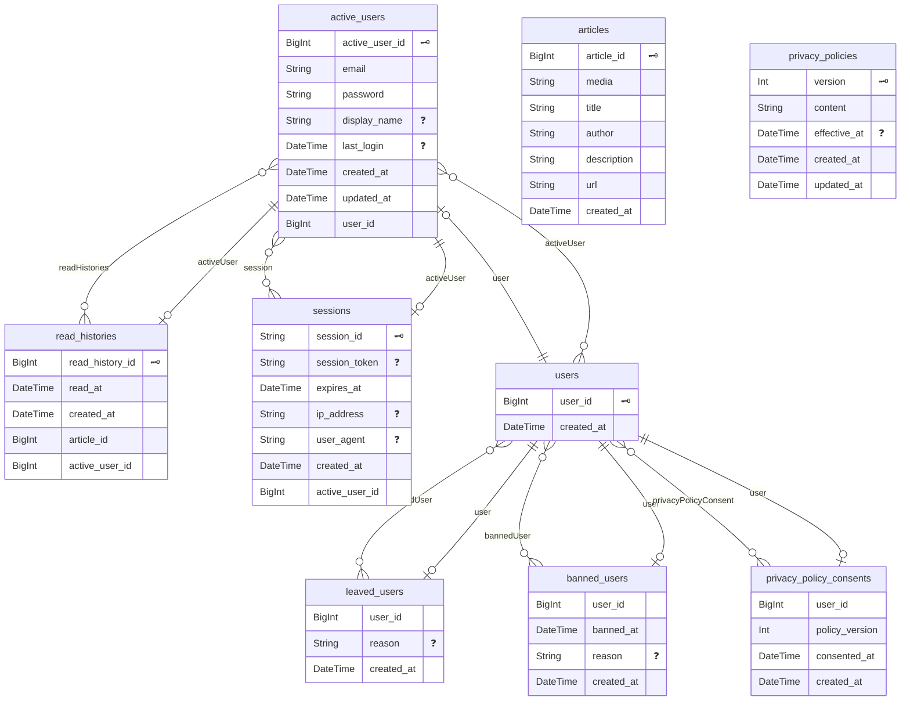

```mermaid
erDiagram

  "active_users" {
    BigInt active_user_id "🗝️"
    String email 
    String password 
    String display_name "❓"
    DateTime last_login "❓"
    DateTime created_at 
    DateTime updated_at 
    BigInt user_id 
    }
  

  "articles" {
    BigInt article_id "🗝️"
    String media 
    String title 
    String author 
    String description 
    String url 
    DateTime created_at 
    }
  

  "banned_users" {
    BigInt user_id 
    DateTime banned_at 
    String reason "❓"
    DateTime created_at 
    }
  

  "leaved_users" {
    BigInt user_id 
    String reason "❓"
    DateTime created_at 
    }
  

  "privacy_policies" {
    Int version "🗝️"
    String content 
    DateTime effective_at "❓"
    DateTime created_at 
    DateTime updated_at 
    }
  

  "privacy_policy_consents" {
    BigInt user_id 
    Int policy_version 
    DateTime consented_at 
    DateTime created_at 
    }
  

  "read_histories" {
    BigInt read_history_id "🗝️"
    DateTime read_at 
    DateTime created_at 
    BigInt article_id 
    BigInt active_user_id 
    }
  

  "sessions" {
    String session_id "🗝️"
    String session_token "❓"
    DateTime expires_at 
    String ip_address "❓"
    String user_agent "❓"
    DateTime created_at 
    BigInt active_user_id 
    }
  

  "users" {
    BigInt user_id "🗝️"
    DateTime created_at 
    }
  
    "active_users" o|--|| "users" : "user"
    "active_users" o{--}o "sessions" : "session"
    "active_users" o{--}o "read_histories" : "readHistories"
    "banned_users" o|--|| "users" : "user"
    "leaved_users" o|--|| "users" : "user"
    "privacy_policy_consents" o|--|| "users" : "user"
    "read_histories" o|--|| "active_users" : "activeUser"
    "sessions" o|--|| "active_users" : "activeUser"
    "users" o{--}o "active_users" : "activeUser"
    "users" o{--}o "leaved_users" : "leavedUser"
    "users" o{--}o "banned_users" : "bannedUser"
    "users" o{--}o "privacy_policy_consents" : "privacyPolicyConsent"
```
