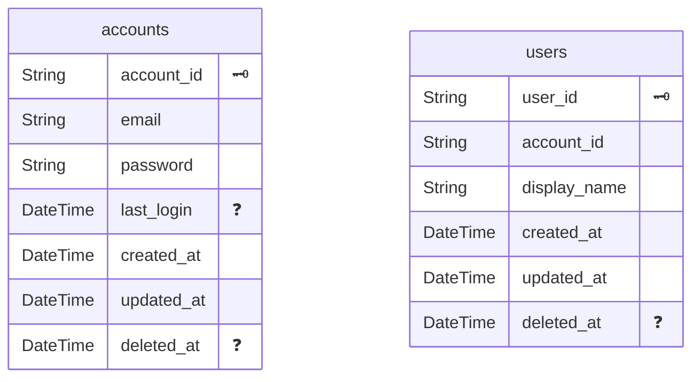

```mermaid
erDiagram

  "accounts" {
    String account_id "🗝️"
    String email 
    String password 
    DateTime last_login "❓"
    DateTime created_at 
    DateTime updated_at 
    DateTime deleted_at "❓"
    }
  

  "users" {
    String user_id "🗝️"
    String account_id 
    String display_name 
    DateTime created_at 
    DateTime updated_at 
    DateTime deleted_at "❓"
    }
  
```
