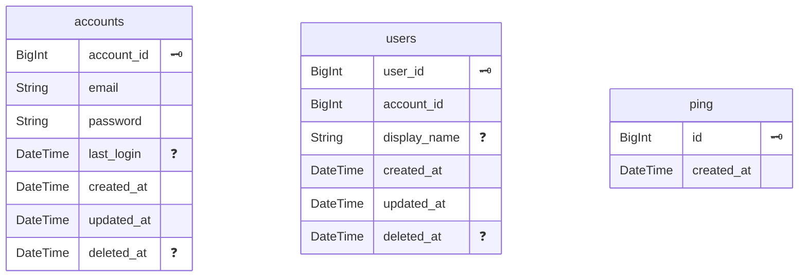

```mermaid
erDiagram

  "accounts" {
    BigInt account_id "🗝️"
    String email 
    String password 
    DateTime last_login "❓"
    DateTime created_at 
    DateTime updated_at 
    DateTime deleted_at "❓"
    }
  

  "users" {
    BigInt user_id "🗝️"
    BigInt account_id 
    String display_name "❓"
    DateTime created_at 
    DateTime updated_at 
    DateTime deleted_at "❓"
    }
  

  "ping" {
    BigInt id "🗝️"
    DateTime created_at 
    }
  
```
