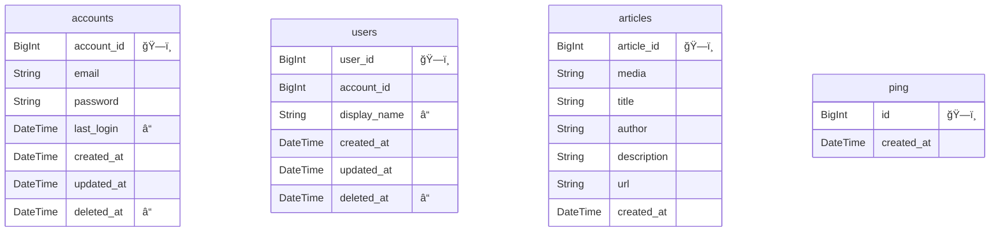

```mermaid
erDiagram

  "accounts" {
    BigInt account_id "ğŸ—ï¸"
    String email
    String password
    DateTime last_login "â“"
    DateTime created_at
    DateTime updated_at
    DateTime deleted_at "â“"
    }


  "users" {
    BigInt user_id "ğŸ—ï¸"
    BigInt account_id
    String display_name "â“"
    DateTime created_at
    DateTime updated_at
    DateTime deleted_at "â“"
    }


  "articles" {
    BigInt article_id "ğŸ—ï¸"
    String media
    String title
    String author
    String description
    String url
    DateTime created_at
    }


  "ping" {
    BigInt id "ğŸ—ï¸"
    DateTime created_at
    }

```
